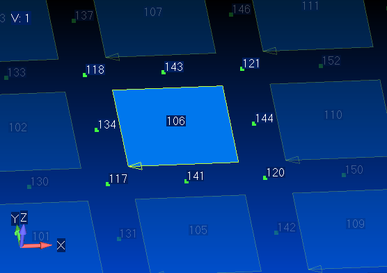

# Femap---Rotate-Element-First-Edge
Moves a planar element's first edge to an adjacent edge.

This macro is license-free and released into the public domain.

See also: [How to use Femap Scripts](https://github.com/aaronjasso/How_to_use_Femap_Scripts) and [The List of my Femap Scripts](https://github.com/aaronjasso/My-Femap-Scripts)

---
This macro moves an element's first edge to an adjacent side by shifting the position each node that defines it. The images below demonstrate this.

### Before

```
Element     Node 1      Node 2      Etc...      
-----------------------------
 106         117         118         121         120         134         143         144         141        
```

### After

```
Element     Node 1      Node 2      Etc...      
-----------------------------
 106         120         117         118         121         141         134         143         144        
```

### Notes
1. The element depicted is a quad with midside nodes, but the program works on any planar element; quad or tri, with or without midside nodes.

2. Material directions are defined by referencing the element's X-axis. This macro changes the X-axis and will therefore change the defined material direction. In the future, it might be updated to preserve the material direction, but it does not currently do this.

3. The node lists shown above were made with my [List Nodes on Elements](https://github.com/aaronjasso/Femap---List-Nodes-on-Elements) macro.
